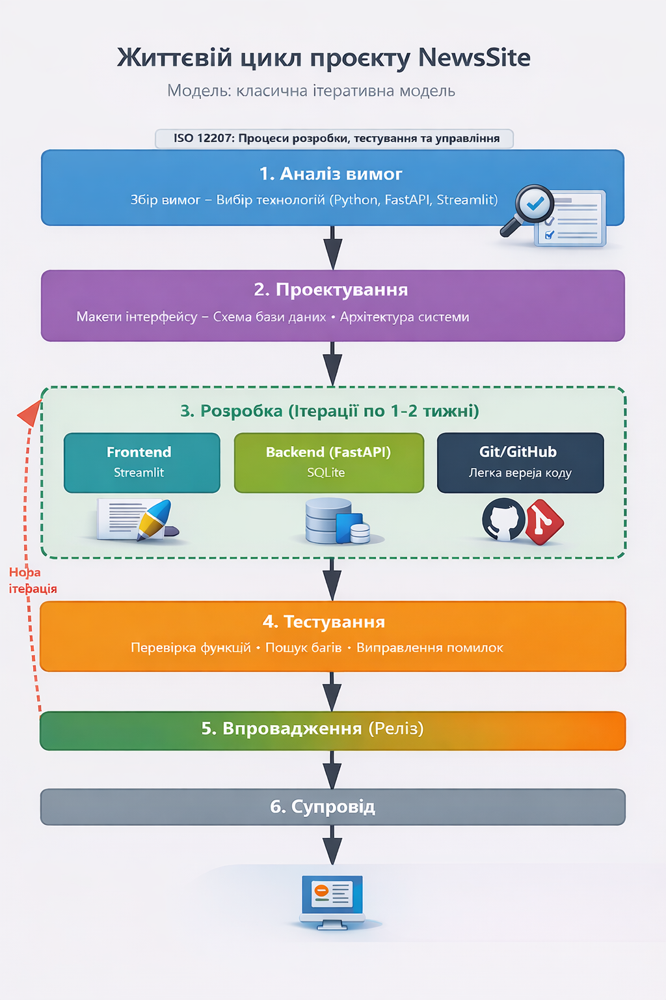
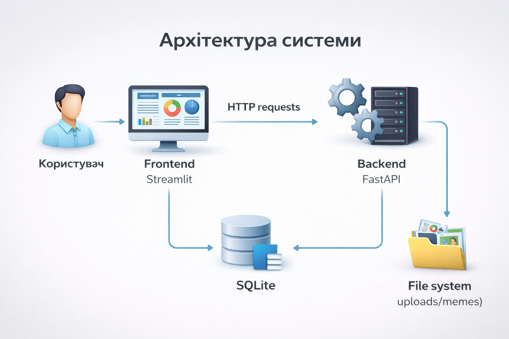
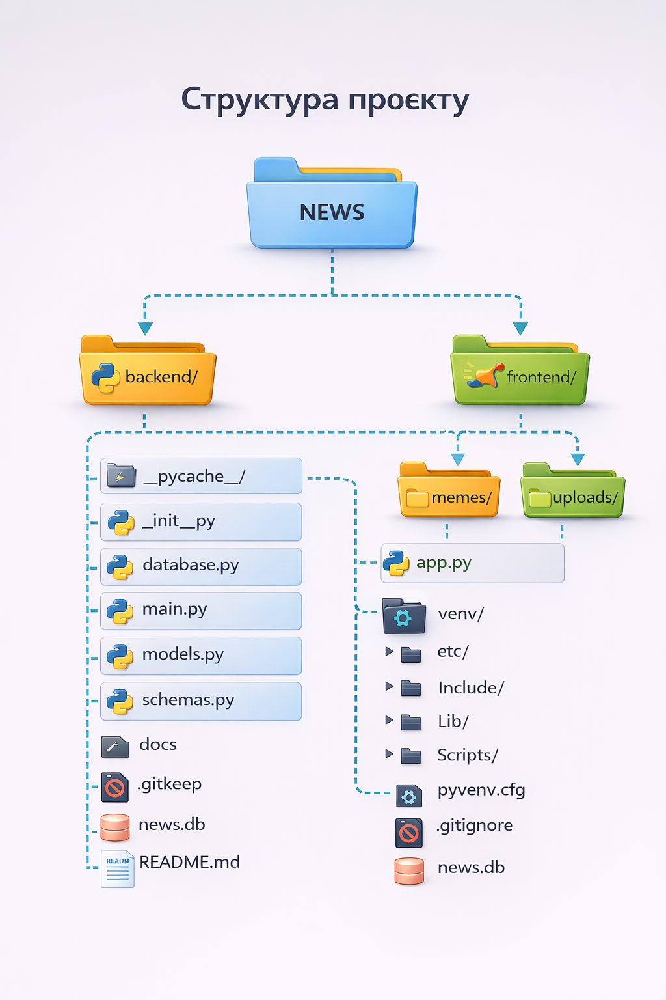

# 📰 NewsSite
## Опис проєкту

**NewsSite** — це вебзастосунок для публікації новин та постів з можливістю додавання зображень, коментарів і лайків.
Проєкт створений як навчальна система для демонстрації повного циклу розробки вебзастосунку з використанням клієнт–серверної архітектури.

Мета проєкту — створити простий, зрозумілий та функціональний новинний сайт без складної реєстрації, з інтуїтивним інтерфейсом та сучасною архітектурою.

Команда проєкту

- **Клим** — Backend / Frontend Developer

---

## ТЗ

### 1. Проблема

 - Багатьом користувачам потрібен простий вебресурс для публікації новин, думок або інформаційних повідомлень без складних налаштувань та зайвих функцій.

### 2. Цільова аудиторія

 - Користувачі, які хочуть швидко публікувати новини

 - Студенти та викладачі для навчальних проєктів

 - Невеликі спільноти та блоги

### 3. Функціональні вимоги

 - [x] Перегляд усіх постів на головній сторінці.

 - [x] Створення постів (ім’я автора, заголовок, текст, зображення).

 - [x] Перегляд повного поста.

 - [x] Лайки для постів.

 - [x] Додавання коментарів.

 - [x] Лайки для коментарів.

 - [x] Автоматичне відображення дати та часу.

 - [x] Випадковий мем із локального сховища.

 - [ ] Авторизація користувачів.

 - [ ] Адмін-панель.

### 4. User Stories

 - Як користувач, я хочу переглядати всі пости на головній сторінці

 - Як користувач, я хочу створювати нові пости з зображеннями

 - Як користувач, я хочу відкривати повний пост

 - Як користувач, я хочу залишати коментарі

 - Як користувач, я хочу ставити лайки постам і коментарям

### 5. Нефункціональні вимоги

Простий та зрозумілий інтерфейс

- Швидке завантаження сторінок

- Коректна робота в сучасних браузерах

- Збереження даних у базі

- Адаптивність інтерфейсу

---

### 6. Технології

 - Backend: Python, FastAPI, SQLAlchemy

 - Frontend: Streamlit

 - База даних: SQLite

 - Інші інструменти: Git, GitHub

## ЖЦ 

---

## Архітектура системи

---

## Структура проєкту


---
## Запуск проєкту

```
- 1. Клонування репозиторію
git clone https://github.com/z3td/NEWS-SITE.git
cd NEWS-SITE
- 2. Створення та активація virtualenv
Set-ExecutionPolicy -ExecutionPolicy RemoteSigned -Scope CurrentUser
python -m venv venv
.\venv\Scripts\Activate.ps1
- 3. Встановлення залежностей
pip install -r requirements.txt
- 4. Запуск backend
uvicorn backend.main:app --reload
- 5. Запуск frontend (в іншому терміналі)
streamlit run frontend/app.py
``` 

---

## Висновок
```
 - Проєкт NewsSite реалізує повний цикл створення вебзастосунку: від аналізу вимог і проєктування архітектури до реалізації, тестування та публікації коду на GitHub.
Система є зручною для користувачів та простою в підтримці й розширенні.
```
---

## Звязок
```
 - **Клим** - **TG** @pravoslavniyprince
```
---
